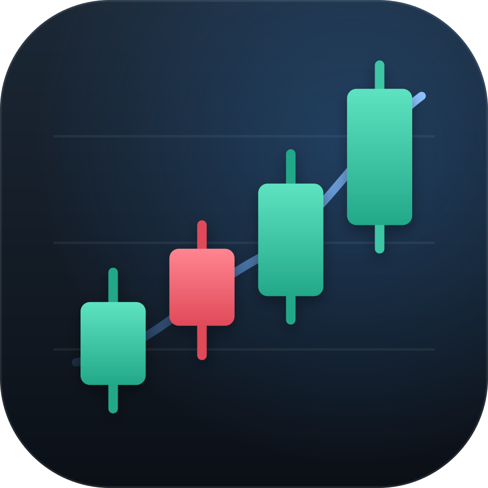

<p align="center"></p>

# Chartroom

A fast, no-nonsense charting app for stocks, futures, and crypto. No account, no API keys, no subscription. Open it and you're looking at SPY.


## Download

Grab the latest build from the [Releases page](https://github.com/groverburger/chartroom/releases/latest):

- **Windows:** download the `.zip`, unzip it anywhere, and run `Chartroom.exe`. Nothing gets installed.
- **macOS:** open the `.dmg` and drag Chartroom into Applications. Works on Apple silicon and Intel.

The builds aren't signed, so the first launch needs one extra click. On Windows, choose **More info → Run anyway**. On macOS, right-click the app and choose **Open**, or allow it under **System Settings → Privacy & Security**.

## What it does

- Multiple charts side by side, each with its own symbol, timeframe, and indicators
- Candlesticks, OHLC bars, line, and point & figure charts
- SMA, EMA, Bollinger Bands, RSI, MACD, ATR, Stochastic, Keltner, Donchian, an MA ribbon, and more
- Trendlines, levels, rectangles, Fibonacci retracements, notes, and a quick shift-drag measure tool
- Ratios and spreads like `RSP/SPY` or `(AAPL+MSFT)/2`
- Watchlists, including live S&P 500 and [open8585](https://groverburger.github.io/open8585/) lists
- Options chains, a stock screener, and company fundamentals
- Your workspace is saved automatically, and cached history works offline

Prices update about once a minute from public endpoints (Nasdaq, Yahoo Finance, TradingView, Binance, and Stooq). That's great for looking at charts, but it isn't a real-time feed, so don't trade off it.

## Building from source

You'll need CMake 3.20+, a C++20 compiler, and libcurl. Everything else (Dear ImGui, GLFW, nlohmann/json) is in `vendor/`.

```sh
cmake -S . -B build -DCMAKE_BUILD_TYPE=Release
cmake --build build --parallel
```

On Windows you'll also need curl from vcpkg. The [full guide](docs/GUIDE.md) has per-platform steps, the WebAssembly build, tests, and a tour of every feature.

## Releasing

Publish a GitHub release and the [release workflow](.github/workflows/release.yml) builds a portable Windows zip and a universal macOS dmg, then attaches both to the release.

## Credits

Built with [Dear ImGui](https://github.com/ocornut/imgui), [GLFW](https://www.glfw.org/), [nlohmann/json](https://github.com/nlohmann/json), and the Roboto font. See [THIRD_PARTY_NOTICES.md](THIRD_PARTY_NOTICES.md) for licenses.
