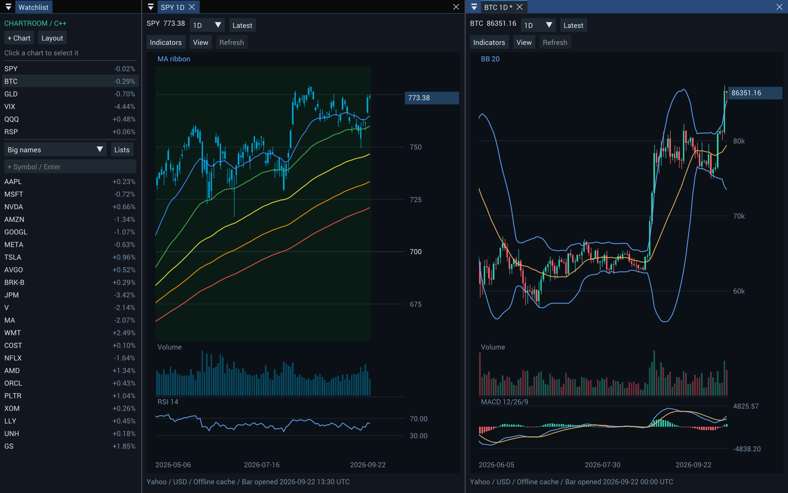

# Chartroom

Chartroom is a minimal charting application for stocks, futures, and crypto. Explore price history, compare symbols across multiple charts, and add technical indicators in a workspace that stays as you left it.

This repository contains the C++20 application, which runs on desktop and in the browser through WebAssembly. It uses Dear ImGui, GLFW, and OpenGL; no Julia runtime is required.



## Features

- **Multiple charts:** independent symbols, timeframes, and indicators, with grid, column, row, and tabbed layouts.
- **Interactive navigation:** pan through history, zoom around the cursor, and inspect prices with a crosshair that snaps to bars. The price axis automatically fits visible data.
- **Chart styles:** candlesticks, OHLC bars, or a line chart, with volume and round-number price levels.
- **Drawings and measurement:** a detachable tools window with saved horizontal levels, trendlines, rays, rectangles, text notes, and Fibonacci retracements, with locking and undo/redo. Shift-drag to measure price changes and elapsed time.
- **Technical indicators:** SMA, EMA, Bollinger Bands, RSI, MACD, ATR, and an MA ribbon with trend-colored bars.
- **Watchlists:** SPY, BTC, GLD, VIX, QQQ, and RSP are pinned above a large-cap list. Create custom lists for other symbols.
- **Event-driven rendering:** redraws for input, data changes, and UI timers, then sleeps when idle. Minimized windows and hidden browser tabs skip rendering.
- **Saved workspaces:** charts, indicators, colors, layouts, watchlists, and chart positions persist between sessions. Cached history is available offline.

SPY opens on first launch. Market data comes from Yahoo Finance, with updates approximately once per minute for open charts.

## Build and run

Desktop builds require CMake 3.20 or newer, a C++20 compiler, and libcurl development files. Dear ImGui, GLFW, the JSON library, and the Roboto font are included in the repository.

Run the commands below from the repository root. macOS and Chromium have been tested; build configurations for Windows and Linux are also included. The [CI workflow](.github/workflows/build.yml) defines builds for all three desktop platforms and WebAssembly.

### macOS

Install Xcode Command Line Tools and CMake. The macOS SDK provides curl and OpenGL.

```sh
cmake -S . -B build -DCMAKE_BUILD_TYPE=Release
cmake --build build --config Release --parallel
open build/chartroom.app
```

### Windows

Install Visual Studio 2022 with C++ development tools, CMake, and vcpkg. Set `VCPKG_ROOT` to the path of the vcpkg checkout, then run in PowerShell:

```powershell
vcpkg install curl:x64-windows
cmake -S . -B build -DCMAKE_TOOLCHAIN_FILE="$env:VCPKG_ROOT/scripts/buildsystems/vcpkg.cmake"
cmake --build build --config Release --parallel
.\build\Release\chartroom.exe
```

When distributing a Windows build, include the dependency DLLs copied beside the executable and the third-party license notices.

### Linux

On Debian or Ubuntu, install the build dependencies:

```sh
sudo apt-get install cmake g++ libcurl4-openssl-dev libgl1-mesa-dev xorg-dev libwayland-dev libxkbcommon-dev
```

Then build and launch:

```sh
cmake -S . -B build -DCMAKE_BUILD_TYPE=Release
cmake --build build --config Release --parallel
./build/chartroom
```

### Browser

The browser build requires Emscripten 4.0.23 and Python 3 for the local preview server. With the Emscripten SDK installed:

```sh
source /path/to/emsdk/emsdk_env.sh
emcmake cmake -S . -B build-web -DCMAKE_BUILD_TYPE=Release -DBUILD_TESTING=OFF
cmake --build build-web --parallel
python3 scripts/serve_web.py --directory build-web --port 8080
```

Open <http://localhost:8080/chartroom.html> in a browser with WebGL2 support. The canvas supports high-DPI displays, including Retina screens.

The preview server serves the application and proxies its Yahoo Finance requests. A public deployment needs an equivalent data proxy because Yahoo's chart endpoint cannot be accessed directly from the browser under CORS. Hosting only the HTML, JavaScript, and Wasm files will not provide market data. The included server binds to localhost and is intended for development.

## Using Chartroom

### Charts and navigation

Click a chart to select it, then click a symbol in the sidebar to change its symbol. To load a symbol without adding it to a watchlist, type it into **Go to symbol** above the sidebar tickers and press **Enter** or **Go**. Ctrl-click or Cmd-click a symbol to open another chart. Charts can be duplicated, closed, arranged into preset layouts, or docked by dragging their tabs.

| Action | Control |
| --- | --- |
| Pan through history | Drag horizontally, swipe left/right with two fingers on a trackpad, or Shift-scroll |
| Zoom around the cursor | Scroll vertically over a chart |
| Pan with the keyboard | Left/Right arrows or A/D while the pointer is over a chart |
| Jump to the oldest data | Home |
| Return to the latest 220 bars | End, double-click, or **Latest** |
| Change chart style | **View → Chart style** |
| Use a logarithmic price axis | **View → Price scale → Logarithmic** |
| Measure a move | Shift-drag between two points |
| Undo / redo a drawing edit | Ctrl/Cmd+Z / Ctrl/Cmd+Shift+Z (or Ctrl+Y) |

Panning can extend beyond the available history. Vertical scaling stays automatic when panning or zooming. Over loaded history, the crosshair snaps horizontally to each bar's center and displays its OHLCV values; in empty space it follows the pointer freely.

Trackpad scrolling follows the gesture's initial direction: horizontal swipes pan, while vertical swipes zoom. Small diagonal movements and momentum do not switch between the two.

Each chart shows **Updated** with the UTC time of its last successful data refresh. Hover over the timestamp for Yahoo’s price timestamp and cache/refresh status. Failed refreshes retain the last successful time.

Logarithmic mode gives equal percentage moves equal vertical distance. The setting is saved per chart and copied when duplicating a chart. Candles, price overlays, crosshairs, and drawings share the scale; volume and oscillator panes retain their own axes. Auto-fit remains active. If visible price data or an overlay includes zero or negative values, the chart temporarily uses linear scaling and shows a notice. Fibonacci levels retain their configured arithmetic price ratios.

OHLC bars use a left tick for the opening price and a right tick for the closing price.

### Drawings and measurement

Open **Draw** on a chart to show the drawing tools window. Drag its title bar to move or dock it. Desktop builds let you drag it outside the main application window; in the browser it floats inside the canvas. The window stays open between drawings, and its position and open/closed state are saved. Use the chart selector at the top to choose which chart receives the tool.

Choose a tool:

- **Horizontal level** and **Text note:** click to place.
- **Trend line**, **Ray**, and **Rectangle:** drag between two points.
- **Fibonacci retracement:** click the start and end of a move, or drag between them.
- **Measure:** drag to see price change, percentage change, bar count, and elapsed time. **Shift-drag** is a shortcut that works without choosing a tool.

After placing a drawing, the chart returns to **Select / pan**. Click a drawing to select it, drag its body to move it, or drag an endpoint to reshape it. Right-click or double-click a drawing to edit its color, prices, text, lock state, or timeframe visibility. Choose **Apply** to commit settings. Locked drawings remain selectable but cannot be dragged or deleted until unlocked.

**Delete** removes the selected unlocked drawing. **Esc** cancels an unfinished drawing or drag, clears a measurement, or deselects a drawing. Measurements are temporary and do not create saved objects. Dragging empty chart space continues to pan.

Drawings are saved by symbol and shared across charts of that symbol. Each drawing can appear on all timeframes or just one, and **Draw → Show drawings** controls visibility for the current chart. Anchors use timestamps and prices, so loading earlier history does not shift annotations onto different bars. Drawings do not expand the automatic price range beyond the visible market data and indicators.

Fibonacci retracements start with levels 0, 0.236, 0.382, 0.5, 0.618, 0.786, and 1. Level 0 sits at the second anchor and level 1 at the first; **Reverse** swaps them. Right-click the drawing or choose **Edit selected** in the tools window to customize up to 24 levels, including negative ratios and extensions beyond 1. Each level has its own visibility and color. Settings also include left/right extensions, ratio or percentage labels, prices, a baseline, and optional background shading.

Undo and redo cover drawing creation, movement, settings, locking, and deletion across symbols. Each completed drag is one edit. The most recent 200 edits are available during the current session; saved drawings persist after restarting, while undo history resets.

### Indicators and colors

Open **Indicators** to search for and add an indicator. Expand an entry under **On this chart** to edit its settings.

SMA and EMA indicators each have a **Line color** setting. New moving averages automatically cycle through a color palette to help distinguish them.

**MA ribbon colored bars** combines the 20, 50, 100, 150, and 200 EMAs. Their ordering determines the bar color, from strong bearish to strong bullish. Its settings include:

- Independent toggles for colored bars, moving average lines, and bullish/bearish background shading.
- The chart's timeframe or a custom source timeframe: 1h, 4h, 1D, or 1W.
- Separate colors for all five moving averages.

Historical ribbon values are aligned without looking ahead to future source bars. Values based on an unfinished source bar can change as new data arrives. Indicator settings are saved per chart and copied when a chart is duplicated.

### Watchlists

Create a custom list, then enter symbols to add them. Right-click a symbol to reorder or remove it. Lists can also be renamed or deleted. Sidebar percentages use Yahoo’s current regular-session price and explicit previous close, refreshing approximately every minute for symbols in the selected watchlist and open charts. Requests are staggered, and stale or failed quotes appear muted; hover for the quote time or error. Chart refreshes also request a fresh sidebar quote.

## Market data

Chartroom uses Yahoo Finance OHLC history and retains downloaded data in a local cache. Supported timeframes are 1h, 4h, 1D, and 1W. Hourly requests cover up to 729 days; daily and weekly requests use the available history. Four-hour candles are aggregated in UTC buckets.

Open charts and custom indicator source series refresh approximately every 60 seconds, using recent minute data and overlapping history to update candles. Charts positioned at the latest candle follow new bars; historical views retain their position. If a download fails, cached data remains available and the application retries later.

Invalid zero-price VIX candles are rejected, including ones saved by older builds. Recent daily VIX candles can be rebuilt from hourly data when every expected hourly bucket is available, using Yahoo’s session boundaries. Rebuilt candles are identified in the chart status; incomplete coverage leaves the candle unavailable or retains a previously valid cached candle.

Yahoo Finance is an unofficial snapshot source: prices may be delayed, requests may be rate-limited, and history may contain gaps. Chartroom does not substitute synthetic prices when data is unavailable. Prices use the provider's OHLC values rather than adjusted close. Futures use Yahoo's `=F` symbols without additional contract-roll adjustments.

## Saved state and offline use

Workspace settings and cached market data are stored locally:

| Platform | Location |
| --- | --- |
| macOS | `~/Library/Application Support/ChartroomCpp` |
| Windows | `%LOCALAPPDATA%/ChartroomCpp` |
| Linux | `$XDG_DATA_HOME/chartroom-cpp`, or `~/.local/share/chartroom-cpp` |
| Browser | IndexedDB for the site's origin |

Browser storage is separate from desktop storage and is subject to browser quotas and site-data clearing. Changing the site's hostname or port creates a separate workspace.

Desktop command-line options include:

| Option | Purpose |
| --- | --- |
| `--data-dir PATH` | Use a different workspace and cache directory |
| `--offline` | Open using cached history without downloading updates |
| `--fetch SYMBOL` | Check the Yahoo data connection without opening a window |
| `--import-julia PATH` | Import a workspace from the Julia version on first launch |
| `--version` | Print the build version and UTC build time |
| `--help` | List all available options |

On macOS, pass options to `build/chartroom.app/Contents/MacOS/chartroom` rather than to `open`.

### Importing from the Julia version

To migrate an existing workspace, pass the path to its `.chartroom` directory on the first launch. For example, on macOS:

```sh
build/chartroom.app/Contents/MacOS/chartroom --import-julia /path/to/chartroom/.chartroom
```

Import runs only when there is no saved C++ workspace. It copies charts, indicators, watchlists, time ranges, and cached data without modifying the source files. The panel arrangement is recreated, and the price axis uses automatic fitting.

## Idle behavior

Chartroom is designed to stay open. It renders in response to input, data updates, window changes, and UI timers such as text-cursor blinking. Once the interface settles, it stops issuing frames until another event needs one. Data refreshes and workspace saves are scheduled independently of rendering.

Minimized desktop windows and hidden browser tabs skip rendering and redraw when shown again. Background work continues on its own schedule; browser background timer throttling can delay refreshes in hidden tabs.

## Build versions

The sidebar shows the version of the running application, such as `v0.1.0+12`. Hover over it for the UTC build time and update status. Every application build automatically advances the build number, including rebuilds with no source changes. Native and browser builds share a counter in `.build-sequence` within the checkout; keep that file to retain the sequence. Separate fresh checkouts start their own sequence.

After a successful link, the build publishes `build-info.json`. Once a minute, a running app checks the manifest for its installation: desktop builds read the file beside the executable (inside Resources on macOS), and browser builds fetch it from the server. A newer build shows **Restart to update** on desktop or **Reload** in the browser. The Reload button saves the workspace before reloading. These checks compare against the installed or served build, not a remote release catalog.

Distribute `build-info.json` with the executable or web files. Web hosts should revalidate HTML, JavaScript, and Wasm files when reloading so an older cached bundle cannot outlive its manifest.

## Development

Run the core and persistence tests after a desktop build:

```sh
ctest --test-dir build -C Release --output-on-failure
```

The `chartroom_gui_tests` executable checks native UI behavior and requires a desktop with an OpenGL context. It is located in `build/` for single-configuration builds or `build/Release/` for a Visual Studio Release build.

The optional [browser integration test](test/browser_test.cjs) uses Node.js and Playwright. With the preview server running on port 8080:

```sh
CHARTROOM_URL=http://localhost:8080/chartroom.html node test/browser_test.cjs
CHARTROOM_URL=http://localhost:8080/chartroom.html node test/browser_drawing_test.cjs
CHARTROOM_URL=http://localhost:8080/chartroom.html node test/browser_idle_test.cjs
CHARTROOM_URL=http://localhost:8080/chartroom.html node test/browser_build_test.cjs
CHARTROOM_URL=http://localhost:8080/chartroom.html node test/browser_vix_test.cjs
CHARTROOM_URL=http://localhost:8080/chartroom.html node test/browser_quote_test.cjs
CHARTROOM_URL=http://localhost:8080/chartroom.html node test/browser_log_test.cjs
```

Set `PLAYWRIGHT_MODULE` if Playwright is outside the normal Node module path, or `CHROMIUM_EXECUTABLE` to use a specific Chromium binary. The tests cover data loading, navigation, drawing gestures, undo/redo, measurement, multiple charts, persistence, resizing, pixel-density changes, Fibonacci settings, floating-window persistence, build update notices, idle rendering, and background refresh deadlines.

For a bounded desktop idle check, run the executable with `--idle-check 10`. It prints frame and wake counts after ten seconds, including startup. Add `--offline` to exclude network updates and use `--data-dir PATH` for an isolated workspace. In the browser, `Module.chartroomStats` exposes frame and wake counts in the developer console.

The main source files are:

| Files | Responsibility |
| --- | --- |
| [core.cpp](src/core.cpp), [core.hpp](src/core.hpp) | Chart navigation, market-data parsing, indicator calculations, and serialization |
| [drawings.cpp](src/drawings.cpp), [drawing_ui.cpp](src/drawing_ui.cpp) | Drawing anchors, edit history, measurement, and chart interactions |
| [state.cpp](src/state.cpp), [state.hpp](src/state.hpp) | Data updates, caches, watchlists, and workspace persistence |
| [net.cpp](src/net.cpp), [net.hpp](src/net.hpp) | Desktop and browser HTTP requests |
| [app.cpp](src/app.cpp) | Interface and chart rendering |
| [main.cpp](src/main.cpp), [render_schedule.cpp](src/render_schedule.cpp), [scheduler.js](web/scheduler.js) | Platform startup, event scheduling, UI deadlines, and command-line options |

Dependency and font licenses are listed in [Third-party notices](THIRD_PARTY_NOTICES.md).
